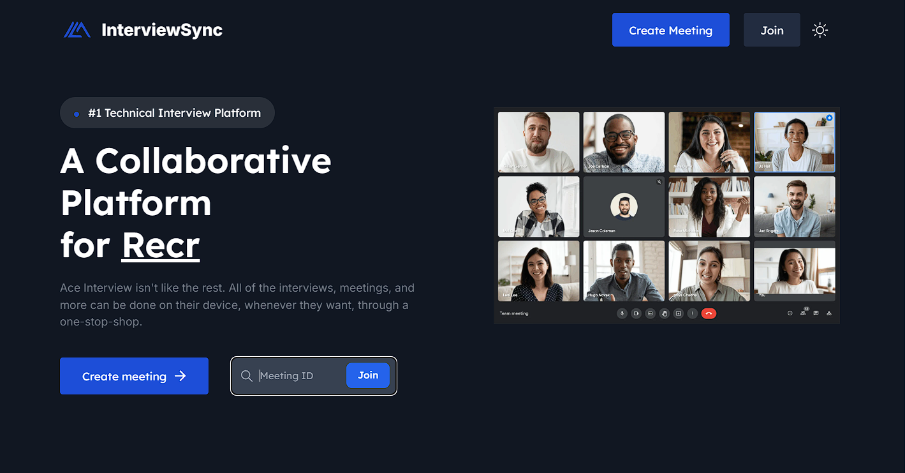
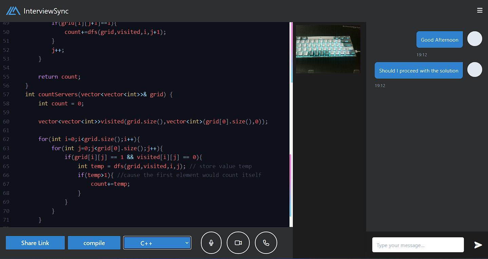

<p align="center">
   
</p>

# InterviewSync: A Scalable Platform for Streamlined Technical Interviews

## Overview

InterviewSync is an open-source platform designed to revolutionize technical interviews by integrating video conferencing, real-time collaborative coding, and automated code compilation. This unified solution simplifies the interview process for both interviewers and candidates, ensuring efficient and effective evaluations. Whether you're assessing a candidate’s coding skills or reviewing their problem-solving approach, InterviewSync provides the tools you need in one seamless platform.

<p align="center">
   
</p>

<p align="center">
   
</p>

## Mission Statement

The technical interview process can often be fragmented, inefficient, and stressful for both interviewers and candidates. InterviewSync’s mission is to provide a streamlined, scalable, and secure platform that enhances the experience for all stakeholders while maintaining the rigor required for effective technical evaluations.

## Key Features

### Unified Platform

- Conduct technical interviews on a single platform.
- Integrated video chat for face-to-face interactions.
- Real-time collaborative coding environment with syntax highlighting, auto-completion, and error detection.
- Multi-language support with built-in code compilation and execution.

### Scalable

- Designed to scale seamlessly, accommodating interviews from startups to large enterprises.
- Custom functionality using Sockets.
- Hosted on OnRender and Vercel.

### Detailed Reporting

- Automatically generates comprehensive interview reports.
- Includes code submissions, compiler outputs, timestamps, and interviewer feedback.
- Exportable formats (e.g., PDF, CSV) for archiving or sharing with hiring teams.

### Enhanced Security

- End-to-end encryption for video calls and data transfer.
- Secure sandboxes for code compilation to prevent malicious exploits.
- Role-based access control (RBAC) to ensure secure interview management.

### Developer-Friendly

- Open-source and customizable to suit organizational needs.
- Modular architecture that allows easy addition of new features.
- RESTful APIs for seamless integration with applicant tracking systems (ATS).

## Technology Stack

- **Frontend:** React.js, Tailwind CSS
- **Backend:** Node.js, Express.js
- **Real-Time Features:** WebRTC, Socket.IO
- **Database:** Firebase
- **Deployment:** Vercel, OnRender

## Installation

1. Clone the repository:
   ```bash
   git clone https://github.com/K-Daksh/Interview_Sync.git
   ```
2. Navigate to the project directory:
   ```bash
   cd Interview_Sync
   ```
3. Install dependencies:
   ```bash
   npm install
   ```
4. Set up environment variables in a `.env` file (refer to `example.env`):
   ```
   FAST_API_KEY = ************************
   ```
5. Run the development server:
   ```bash
   npm run dev
   ```
6. Access the platform at `http://localhost:3000`.

## Project Status

InterviewSync is under active development with a focus on achieving a robust and scalable architecture. Our goal is to release the open-source code soon, empowering the community to build upon and improve the platform. Stay tuned for updates!

## Roadmap

### Phase 1: Initial Release

- Core functionality: video conferencing, collaborative coding, and basic reporting.
- Support for top programming languages (e.g., Python, Java, C++, JavaScript).

### Phase 2: Enhanced Features

- Advanced reporting with interviewer feedback templates.

### Phase 3: Community Contributions

- Encourage open-source contributions to expand language support and add innovative features.
- Host webinars and workshops to onboard contributors.

## Call to Action

We’re building InterviewSync to make technical interviews better for everyone—and we need your help! Join us in shaping the future of this platform by contributing to its development, providing feedback, or sharing it with others.

- **GitHub Repository:** [InterviewSync](https://github.com/K-Daksh/Interview_Sync)
- **Get Involved:** Submit issues, pull requests, or feature suggestions on GitHub.
- **Stay Connected:** Follow our progress and updates via the repository or reach out to our team.

Together, let’s redefine the technical interview experience!
